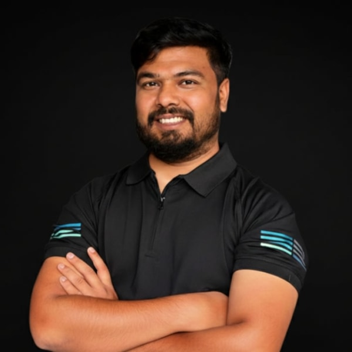

### Hi there, I'm Nayeem Islam 👋

**Manager II – Lead, Applied ML Engineer** at [NEXT Ventures](https://linkedin.com/in/islamnayeem)

I build and ship production AI systems — LLM pipelines, RAG architectures, and agentic workflows — at scale across fintech and enterprise platforms.

📍 Dhaka, Bangladesh &nbsp;|&nbsp; 6+ years in software & AI engineering

 

---

**Currently working with**

---

**Find me around the web**

- Portfolio → [nayeem-islam.vercel.app](https://nayeem-islam.vercel.app)
- LinkedIn → [linkedin.com/in/islamnayeem](https://linkedin.com/in/islamnayeem)
- Writing → [medium.com/@nomannayeem](https://medium.com/@nomannayeem)
- Mail → [nayeem60151126@gmail.com](mailto:nayeem60151126@gmail.com)

---

